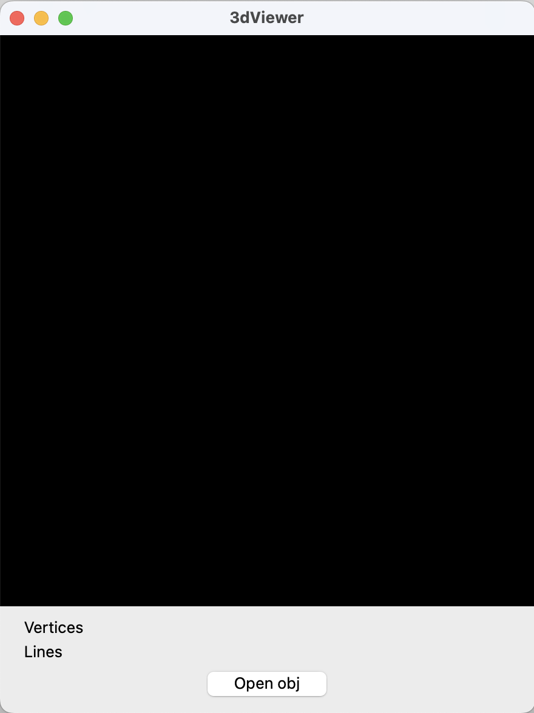
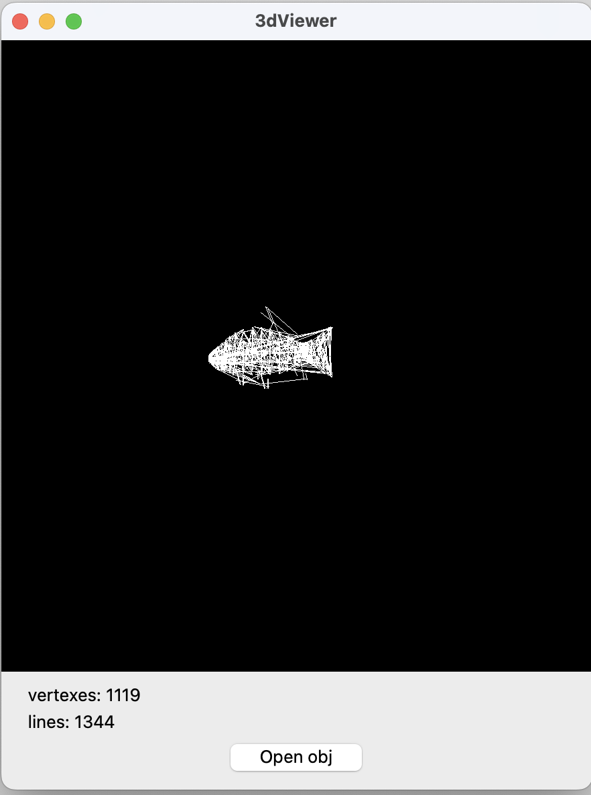

# 3DViewer
## Preview

----------------------

Support file (only .obj)

----------------------

Finally

----------------------

#### Also you can rotate model with mouse

## Installation instruction
App for MacOS (or linux)
Before installation You must have: qmake, g++
1) Go to terminal
2) Paste this text to terminal one by one
> git clone git@github.com:ket03/3D_Viewer.git

> cd 3D_Viewer

> make install

> open build

Completed. Just open app

## Other
Also you can:

Uninstall app
> make uninstall

Сlean up the trash
> make clean

Archive directory
> make dist

Open Readme.md
> make dvi